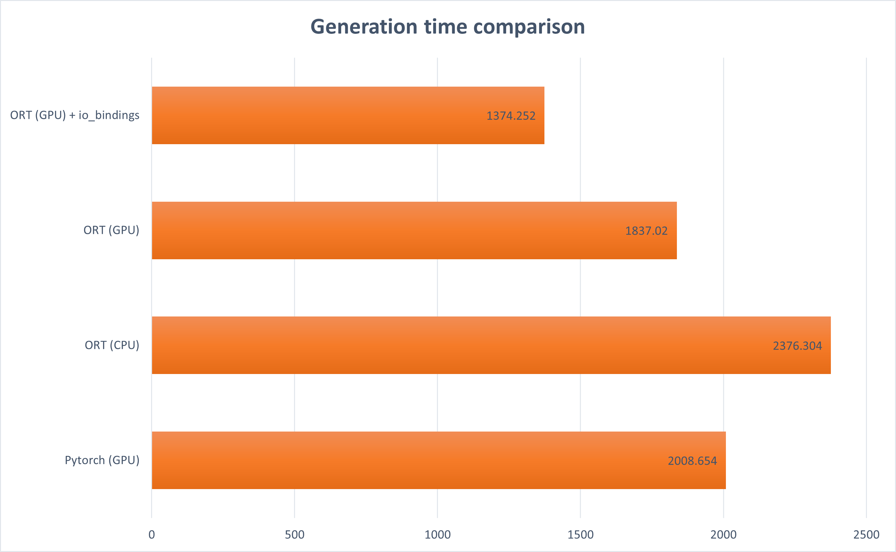

# Tortoise-TTS ONNX Inference

This project converts the **GPT2** module in the pre-trained Tortoise-TTS model to ONNX format and provides an example of how to do inference with the ONNX model.

We only convert the GPT2 module to ONNX, while other modules still use PyTorch for inference, excluding the CLVP module.

## Usage

See [run.sh](./run.sh) for running the example.

## Update

1. GGUF inference 2024/07/17

GGUF model conversion is now supported. See [convert_hf_to_gguf.py](./convert_hf_to_gguf.py) and [run.sh](./run.sh) for more details.
For information on how to perform inference with the GGUF model, please refer to the [tortoise.cpp repository](https://github.com/balisujohn/tortoise.cpp).

## Prefill and Decode Models

The GPT2 module in Tortoise-TTS cannot be exported into a single model due to significant differences in the input process between the two stages (prefill and decode). This project exports it into two independent models: prefill and decode models.

The prefill model is used to generate the first token, while the decode model is used to generate subsequent tokens. Their calling relationship is shown in the diagram below:

It is necessary to output **hidden states** to serve as inputs for diffusion. **Note**: hidden_states and logits are different, corresponding to different layer outputs. Logits are used for sampling to get the next token.

## Performance

Compared to the PyTorch implementation based on Transformers, the ONNX model inference speed is increased by **46%** (including prefill and decode processes).

Test environment: V100, single GPU, generating 48 tokens, using greedy search, batch_size=1;

The image above uses milliseconds as the unit of measurement. When leveraging the `io_binding` feature, ORT (short for ONNX Runtime) achieves fast GPU-based inference speeds.

For the converted onnx models and saved `AutoModel`, visit [OpenT2S/Tortoise-TTS-onnx-infer on Hugging Face](https://huggingface.co/OpenT2S/Tortoise-TTS-onnx-infer).
