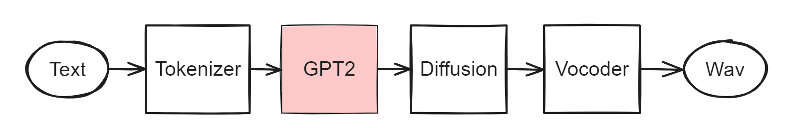
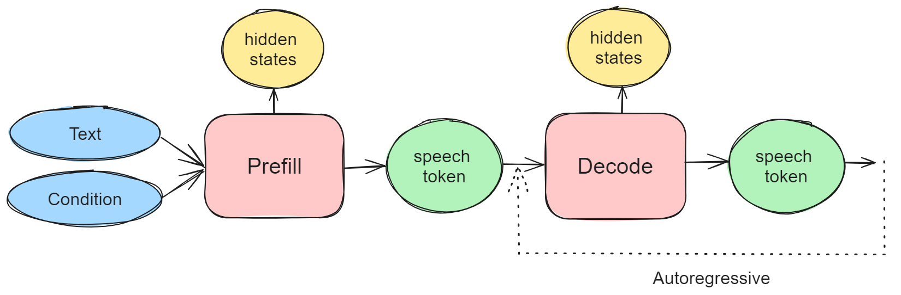

# Tortoise-TTS ONNX Inference

This project converts the GPT2 module in the pre-trained Tortoise-TTS model to ONNX format, and provides an example of how to do inference with the ONNX model.

我们只转换GPT2模块为onnx，其他模块还是使用Pytorch做推理，去掉了CLVP模块。

## Usages

see [run.sh](./run.sh) for running the example.

## Prefill and Decode Models
The GPT2 module in tortoise-tts cannot be exported into a single model, as the input process of the two stages (prefill and decode) have a big difference. This project export it into two independent models: prefill and decode models. 

Prefill model用于生成第一个token，decode model用于生成后续的token。他们调用关系如下图所示：

这里需要输出hidden states，用于作为diffusion的输入。需要注意：hidden_states和logits是不同的，对应不同层的输出，logits用来采样获取next token。

## 性能

相比Pytorch实现，onnx模型推理速度提升2倍（只考虑decode过程）。
测试机器：v100，单卡；
